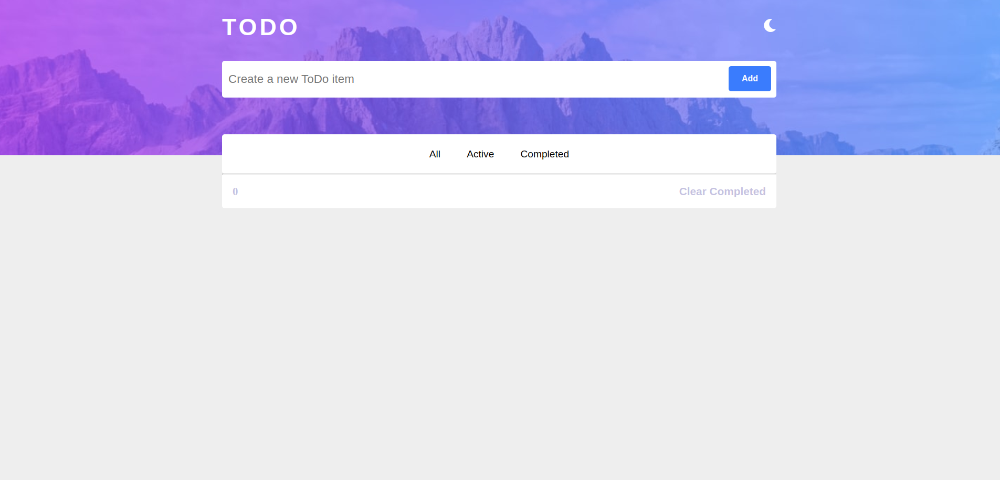

# To-do Application

## Introduction

In this project, I used React to build a to-do application. This project was part of my training in the Azubi Africa Frontend Development program. 

A live demo of the project can be found [here](https://todo-application-iota-topaz.vercel.app/)

### Technologies Used

### Features of the project

The project has an input field that allows users to add their daily tasks in the application.

After a user has added their task to the application it will show up in the "all" tasks tab of the application.

In the image above, there are 3 tasks in the "all" tasks tab. The application allows you to mark tasks as completed and also delete tasks using the icon to the far right. The application also has a function to clear all completed tasks.

The image below shows the "active" tasks that remain after one of the tasks has been marked as completed. This is another functionality of the application. 

The next image shows the "completed" tasks tab of the application. 

### Contact

wilsonsiawse@gmail.com

Wilson Siaw
